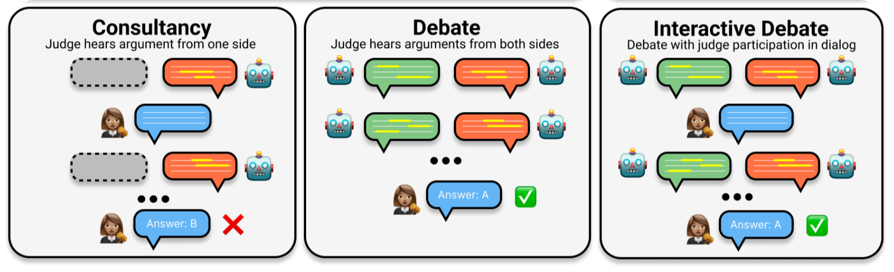

# Aspasia

> **Status:** Work in progress — interfaces and APIs may change.

Small multi-agent framework for running debate protocols using the Inspect framework.

## Description

This framework is built on the Inspect framework and implements protocols and options for debate. As the initial starting point, the paper “Debating with More Persuasive LLMs Leads to More Truthful Answers” is used. See the section with relevant papers below for more context

## Usage
### Download dataset

1. Download the `QuALITY.v1.0.1` dataset from the original repo. By default (see the Makefile), files are downloaded into the repository root directory, `data`.
```bash
make download-data
```

2. (Optional) To manually inspect dataset it is possible to load the preprocessed dataset split into a `MemoryDataset` compatible with the Inspect task. Preprocessing is done according to the instructions from the “Debating with More Persuasive LLMs Leads to More Truthful Answers” appendix.  
Available splits: `train`, `dev`, `test`.

```python
    from pathlib import Path
    from aspasia.datasets import QuALITY
    dataset = QuALITY(Path("PATH_TO_DATA_DIR")).prepare_datasets("dev")
```

### Run Protocol
Protocols can be run in two ways:

1. VS Code extension
2. Inspect command-line interface with a YAML config defined in the `configs` directory

```bash
inspect eval --task-config configs/consultancy_test.yaml src/aspasia/tasks.py@consultancy_runner
```

## Relevant papers
 - Debating with More Persuasive LLMs Leads to More Truthful Answers
 - An Alignment Safety Case Sketch Based on Debate
 - AI Safety via Debate
 - Debate Helps Supervise Unreliable Experts
 - Scalable AI Safety via Doubly-Efficient Debate

## Protocols
<p align="center">
  
  <br>
  <em>Protocols from "Debating with More Persuasive LLMs Leads to More Truthful Answers"</em>
</p>

### Consultancy
Given an article, a question (based on the article), and two answer options, the consultant is asked to choose the best answer based on the article. Before the final decision, the judge can conduct multiple question–answer turns to clarify the consultant’s answer and reasoning. The judge doesn't have access to the article, but the consultant can add citations from the article to support their position.

### Debate
Each debater is assigned a specific option to defend. In QuALITY, every question assumes two options; hence one agent is assigned A and the other B. They conduct N turns of debate, after which the judge decides which option to choose. The judge doesn't have access to the article, but the debaters can add citations from the article to support their positions.

### Interactive Debate
Similar to Debate, but the judge can interact with the debaters after every turn, similar to Consultancy.

### Additional options

#### Human judge
In every protocol, the LLM judge can be replaced by a real person.

#### Symmetric 
The judge has access to all the information the debater/consultant does, except for the consultant’s/debater’s private thoughts (text in `<thinking></thinking>` tags).

## TODOs

### Technical:
- [ ] Add best-of-N.
- [ ] Add refinement techniques: self-reflection, self-critique.
- [ ] Decide on the design of protocols: agent initialization inside or outside.

### Experimental:
- [ ] Add self-awareness for agents using prompts and dynamic labels for messages.
